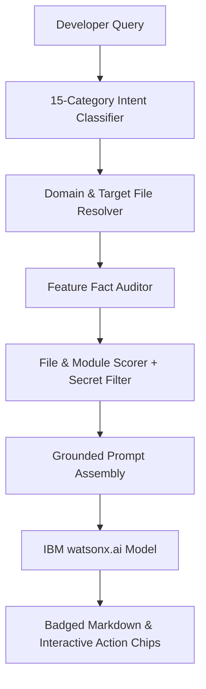

# CodeCompass AI Architecture & Senior Developer Mentor Engine

CodeCompass integrates **IBM watsonx.ai** with a custom repository intelligence engine to act as a **Senior Software Engineer, Technical Mentor, and Codebase Onboarding Guide**.

---

## 1. Architectural Role & Mentor Philosophy

Generic AI chat assistants frequently fail at codebase onboarding:
- They dump disjointed lists of matching files without architectural context.
- They invent nonexistent files or frameworks that aren't in the repository.
- They fail to distinguish between what is implemented and what is missing.

CodeCompass implements a **Senior Developer Mentor** persona:
- **Codebase-Grounded**: Assumes the developer is unfamiliar with the project and teaches using the actual codebase.
- **Progressive Depth**: Explains concepts in stages:
  $$\text{Concept} \longrightarrow \text{Why It Matters} \longrightarrow \text{In This Repository} \longrightarrow \text{Actual Files} \longrightarrow \text{Execution Flow} \longrightarrow \text{Practice Exercise}$$
- **Strict Fact Verification**: Explicitly states when a feature or file is missing rather than hallucinating an answer.

---

## 2. Intent Classification Pipeline (15 Intents)

Before assembling context or calling the model, [`ContextRetrievalService.ClassifyMentorIntent`](file:///d:/CodeCompress/backend/CodeCompass.Api/Services/ContextRetrievalService.cs) categorizes the query into one of 15 intent categories:

1. `LEARNING_ROADMAP`: Generates multi-level curricula (e.g., "Teach me auth beginner to advanced").
2. `BEGINNER_EXPLANATION`: Plain-English conceptual introduction with analogies and file anchors.
3. `FEATURE_EXPLANATION`: Explains how a specific subsystem operates end-to-end.
4. `CODE_WALKTHROUGH`: Step-by-step code execution tracing with verified snippets.
5. `ARCHITECTURE_EXPLANATION`: Multi-layer system breakdown and inter-component dependencies.
6. `REQUEST_FLOW`: End-to-end trace from UI input to persistent storage.
7. `FILE_EXPLANATION`: Explains file responsibilities, methods, callers, and next files to read.
8. `HOW_TO_IMPLEMENT`: Safe implementation recipes adhering to existing repository patterns.
9. `CHANGE_IMPACT`: Direct and indirect blast-radius evaluation with testing strategies.
10. `DEBUGGING`: Root-cause diagnosis using error messages and related handler code.
11. `SECURITY_REVIEW`: Security posture audit, identifying implemented guards vs. missing protections.
12. `COMPARE_CONCEPTS`: Comparative analysis of patterns present in the codebase.
13. `ONBOARDING_GUIDANCE`: First-day orientation and mental model construction.
14. `FOLLOW_UP_QUESTION`: Multi-turn conversational progression ("Continue", "Next", "Explain JWT").
15. `SIMPLE_EXPLANATION`: Direct, concise answer for targeted questions.

---

## 3. Fact Auditing & Status Badging

CodeCompass audits target features against indexed files, labeling topics with standardized tags:
- `[IMPLEMENTED]`: Supported by concrete source files in the repository.
- `[PARTIALLY IMPLEMENTED]`: Incomplete implementation (e.g., plain user storage without password hashing).
- `[NOT IMPLEMENTED — NEXT CONCEPT]`: Missing production concept (e.g., refresh token rotation, MFA, email verification).

The React frontend parses these tokens in [`AssistantPage.tsx`](file:///d:/CodeCompress/frontend/src/AssistantPage.tsx) and renders colored badges:
- `status-badge--implemented` (Green)
- `status-badge--partial` (Amber)
- `status-badge--missing` (Purple)

---

## 4. Grounding & Anti-Hallucination Guardrails

### Target File Non-Existence Protection
When a user asks about an absent file (such as `AuthService.cs` in an endpoint-based repository):
1. The engine checks `targetExists == false`.
2. The prompt instructs the model:
   > *"This repository does not contain a file named `AuthService.cs`. In this codebase, authentication is handled in `Todo.Web/Server/Authentication/AuthenticationExtensions.cs` and `Todo.Web/Server/TodoApi.cs`."*
3. The assistant explains the real files rather than fabricating nonexistent code.

### Secret Filtering
[`ContextRetrievalService`](file:///d:/CodeCompress/backend/CodeCompass.Api/Services/ContextRetrievalService.cs) strictly filters secret-bearing files:
- Excluded names: `.env`, `.env.*`, `secrets.json`, `appsettings.secrets.json`, `credentials.json`, `serviceaccount.json`
- Excluded keys/certs: `*.pem`, `*.p12`, `*.pfx`, `id_rsa`, `id_ed25519`, `*.key`, `*.cert`

---

## 5. Multi-Turn Session Memory

- Each conversation exchange is recorded in `Conversations` with a `SessionId`.
- When short follow-ups are submitted (e.g., `"Continue."`, `"Start Level 1"`, `"Quiz me"`), CodeCompass loads the last 5 turns to enrich query context.
- The assistant advances lessons sequentially without dumping the entire curriculum at once.

---

## 6. IBM watsonx.ai Integration Details

- **Endpoint**: `/ml/v1/text/generation` (IBM Cloud regional instances, e.g. Frankfurt `eu-de` / Dallas `us-south`).
- **Default Models**: `meta-llama/llama-3-3-70b-instruct` or `ibm/granite-3-8b-instruct`.
- **Generation Parameters**:
  - `decoding_method`: `"greedy"`
  - `max_new_tokens`: `2500`
  - `repetition_penalty`: `1.05`
- **Dynamic Regional Model Fallback**: If the configured model is unavailable in the regional cluster, queries `/ml/v1/foundation_model_specs` and retries with available instruct models.

---

## 7. Deterministic Fallback Mode

If no IBM watsonx credentials are provided:
- The system never crashes or errors out.
- [`AssistantService.BuildContextOnlyAnswer`](file:///d:/CodeCompress/backend/CodeCompass.Api/Services/AssistantService.cs) generates structured markdown using verified repository metadata.
- Outputs status badges, ASCII flow charts, primary file citations, and check-your-understanding questions directly from repository facts.
