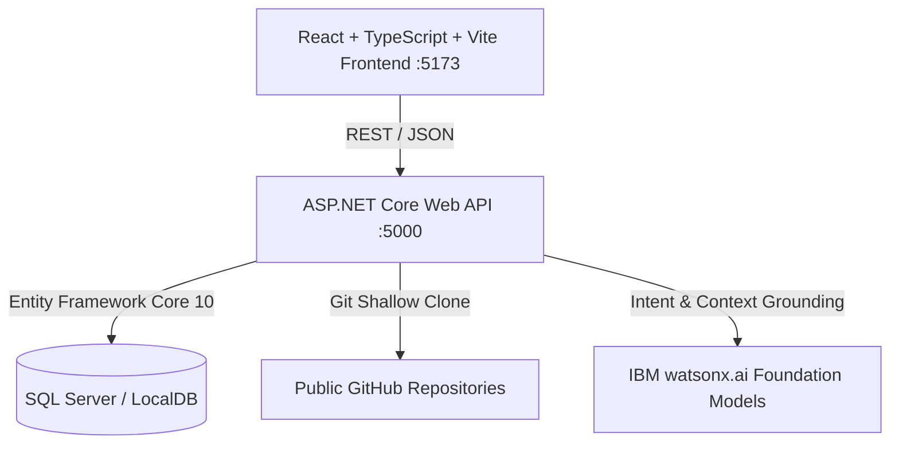
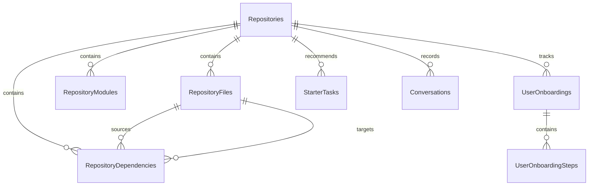

# CodeCompass Architecture Specification

CodeCompass is an AI-powered developer onboarding and codebase intelligence platform built with ASP.NET Core (.NET 10.0), React (TypeScript + Vite), Microsoft SQL Server, and IBM watsonx.ai.

---

## 1. System Overview

---

## 2. Subsystem Breakdown

### 2.1 Frontend Application (`frontend/`)
- **Technology**: React 18/19, TypeScript, Vite, Vanilla CSS design system, `@xyflow/react`.
- **Primary Views**:
  - `App.tsx`: Navigation shell, global repository selector, developer role switcher, system health status pill, and Overview dashboard.
  - `ArchitecturePage.tsx`: Interactive multi-layer node graph, dependency flow pathfinder (BFS), search filtering, and module detail inspection drawer.
  - `AssistantPage.tsx`: Senior developer mentor interface with Markdown rendering, inline status badges (`[IMPLEMENTED]`, `[PARTIALLY IMPLEMENTED]`, `[NOT IMPLEMENTED — NEXT CONCEPT]`), code blocks, flow diagrams, and quick-action next-step chips.
  - `OnboardingPage.tsx`: Dual-mode onboarding path and starter task workspace with real-time milestone progress tracking (`██████░░░░ 60%`), relevant file inspection, and contribution instructions.
  - `CodeCompassLogo.tsx`: Custom SVG developer platform branding.

### 2.2 Backend Web API (`backend/CodeCompass.Api/`)
- **Technology**: C# 14, .NET 10.0 Web API, Entity Framework Core 10.0, ASP.NET Core Middleware.
- **Controllers**:
  - `HealthController`: Exposes `/api/health`, reporting backend status and AI configuration mode (`IBM watsonx • Granite` vs `Repository-grounded mode`).
  - `RepositoriesController`: Handles `/api/repositories`, GitHub repository cloning orchestration, file indexing, and metrics retrieval.
  - `ArchitectureController`: Exposes `/api/repositories/{id}/architecture`, module details (`/api/repositories/{id}/modules/{moduleId}` supporting numeric and `module-{id}` formats), and dependency flow queries (`/api/repositories/{id}/flow`).
  - `AssistantController`: Handles `/api/repositories/{id}/assistant/ask`, session conversation history, and contextual suggestions.
  - `OnboardingController`: Manages `/api/repositories/{id}/onboarding/{role}` and step completion tracking (`/api/onboarding/{id}/steps/{stepId}/complete`).
  - `StarterTasksController`: Recommends curated beginner tasks (`/api/repositories/{id}/starter-tasks`) and blast-radius impact analysis.

### 2.3 Repository Analyzer Engine (`Services/RepositoryAnalyzer.cs`)
- **Clone Isolation**: Executes shallow git clones (`--depth 1 --single-branch`) into sandboxed GUID directories in `Path.GetTempPath()`, guaranteed cleanup via `finally` blocks.
- **Security Guardrails**: Enforces HTTPS GitHub URLs (`https://github.com/owner/repo`), validates URL characters, and rejects command injection tokens (`;`, `&`, `..`).
- **File Classifier**: Indexes file paths, sizes, extensions, and detects programming languages.
- **Module Detector**: Groups directory structures into architectural layers (`Presentation`, `API`, `Backend`, `Business Logic`, `Data Access`, `Shared`, `Tests`, `Infrastructure`).
- **Dependency Parser**: Scans file imports across C# (`using`), TypeScript/JavaScript (`import`/`require`), and Python (`import`/`from`).

### 2.4 Context Retrieval & Developer Mentor Engine (`Services/ContextRetrievalService.cs` & `AssistantService.cs`)
- **Intent Classifier**: Automatically categorizes user queries into 15 distinct intents:
  `LEARNING_ROADMAP`, `REQUEST_FLOW`, `FEATURE_EXPLANATION`, `FILE_EXPLANATION`, `ARCHITECTURE_EXPLANATION`, `CHANGE_IMPACT`, `BEGINNER_EXPLANATION`, `CODE_WALKTHROUGH`, `HOW_TO_IMPLEMENT`, `DEBUGGING`, `SECURITY_REVIEW`, `COMPARE_CONCEPTS`, `ONBOARDING_GUIDANCE`, `FOLLOW_UP_QUESTION`, and `SIMPLE_EXPLANATION`.
- **Repository Fact Auditor**: Verifies features against active code, strictly identifying what is implemented, partially implemented, or missing to prevent LLM hallucinations.
- **File Tiering**: Separates files into Primary Core implementation files and Supporting files.
- **Target File Non-Existence Detection**: Intercepts requests for missing files (e.g., `AuthService.cs`) and points developers to actual existing counterparts.
- **Multi-Turn Conversation Memory**: Loads recent turns by `SessionId` to maintain learning levels across `"Continue."` and follow-up prompts.

### 2.5 IBM watsonx.ai Integration (`Services/WatsonxProvider.cs`)
- Connects to IBM watsonx.ai foundation models (e.g., `meta-llama/llama-3-3-70b-instruct` / `ibm/granite-3-8b-instruct`).
- Employs greedy decoding with 2500 max new tokens.
- Graceful regional model fallback: Queries available regional foundation models if the requested model ID is unavailable.
- Deterministic Offline Fallback: If unconfigured, generates structured repository-grounded markdown without breaking.

---

## 3. Database Schema

The database schema is managed via Entity Framework Core Code-First migrations targeting SQL Server:

- **`Repositories`**: Stores repository metadata (Git URL, Name, Description, Primary Language, AnalyzedAt).
- **`RepositoryFiles`**: Indexed file tree with path, size, language, and directory flags.
- **`RepositoryModules`**: Detected modules with layer mappings, file counts, and descriptions.
- **`RepositoryDependencies`**: Extracted relationships with source/target IDs and import statements.
- **`UserOnboardings`**: Tracks onboarding paths per user/role with dynamic progress percentages.
- **`UserOnboardingSteps`**: Individual learning steps with completion statuses and timestamps.
- **`StarterTasks`**: Low-risk contribution recommendations with difficulty ratings and rationales.
- **`Conversations`**: Multi-turn conversation sessions and answers linked by `SessionId`.
